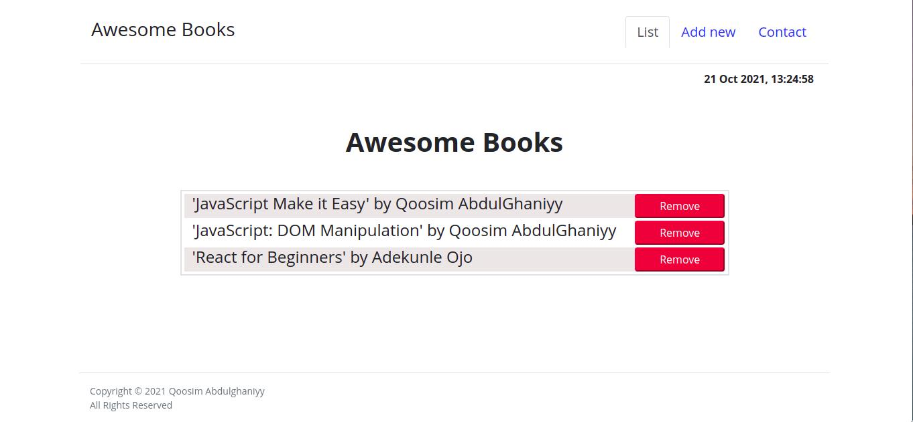
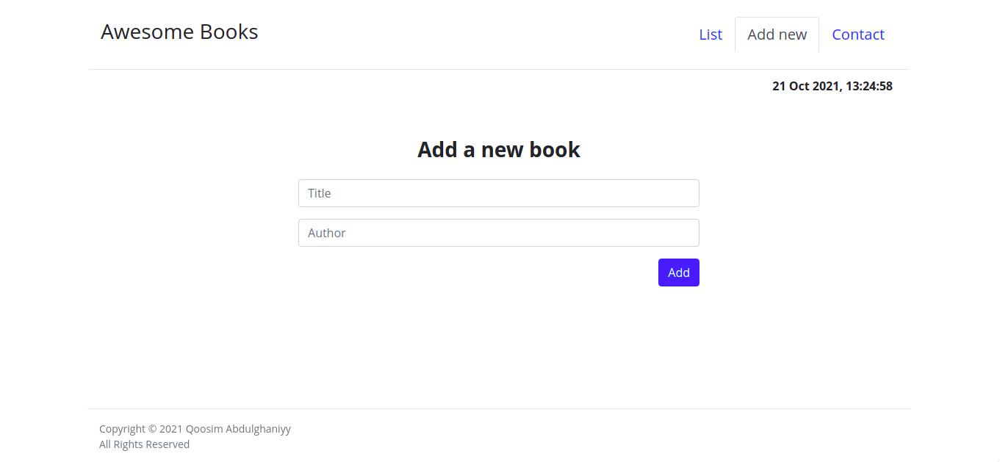
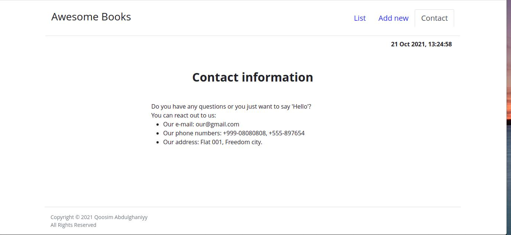

# Awesome Book

> In this project, I built a basic website that allows users to add or remove books from a list. I implemented that by using JavaScript objects, arrays, and local storage. I dynamically modified the DOM and added basic events.








## Technologies used

- HTML && CSS
- JavaScript
- Linters
- Git && Github
- VSCode

## Live Demo

[Live Demo Link](https://qoosim-awesome-books.netlify.app/) :point_left:


## Getting Started

### Prerequisites

- IDE to edit and run the code (We use Visual Studio Code fire).
- Git to versionning your work.

### Install

To get a local copy up and running follow these simple example steps.

- Clone the repository using:
 ```
    git clone git@github.com:Qoosim/Awesome-Books.git 
```
- Navigate to the Awesome-Books with this command ```cd Awesome-Books```

- Install Visual Studio extension [Live Server](https://marketplace.visualstudio.com/items?itemName=ritwickdey.LiveServer)

### Usage

- Enable Live Server

- Add and remove Books!`

## Author

👤 **Qoosim AbdulGhaniyy**

- GitHub: [@githubhandle](https://github.com/Qoosim)
- Twitter: [@twitterhandle](https://twitter.com/qoosim_ayinde)
- LinkedIn: [LinkedIn](https://linkedin.com/in/qoosim)

## 🤝 Contributing

Contributions, issues, and feature requests are welcome!

Feel free to check the [issues page](../../issues/).

## Show your support

Give a ⭐️ if you like this project!

## Acknowledgments

- Hat tip to anyone whose code was used
- Inspiration
- etc

## 📝 License

This project is [MIT](./MIT.md) licensed.
