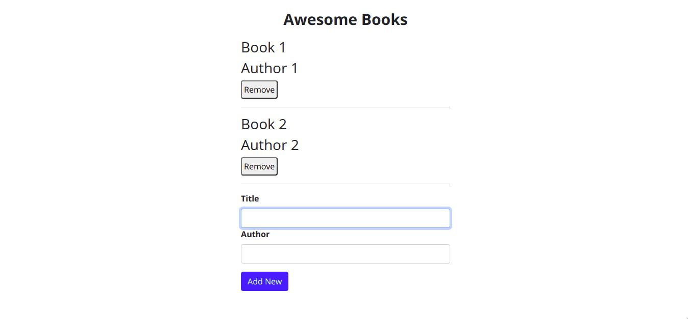

# Awesome Book

> This is a project that allows user to add/remove books from both localStorage and browser memory 



Used JavaScript objects and arrays

## Built With

- HTML && CSS
- JavaScript
- Linters

## Live Demo

[Live Demo Link](https://raw.githack.com/Qoosim/Awesome-Books/basic-html/index.html) :point_left:


## Getting Started

To get a local copy up and running follow these simple example steps.

- Clone the repository using:
- ``shell
-    git clone git@github.com:Cathella/Awesome-Books.git
-    `` 
-    - Navigate to the Awesome-Bookd with this command ```cd Awesome-Books``
-
-    - Install Visual Studio extension [Live Server](https://marketplace.visualstudio.com/items?itemName=ritwickdey.LiveServer)
-
-    - Enable Live Server
-
-    - Add and remove Books!`

## Author

👤 **Qoosim AbdulGhaniyy**

- GitHub: [@githubhandle](https://github.com/Qoosim)
- Twitter: [@twitterhandle](https://twitter.com/qoosim_ayinde)
- LinkedIn: [LinkedIn](https://linkedin.com/in/qoosim)

## 🤝 Contributing

Contributions, issues, and feature requests are welcome!

Feel free to check the [issues page](../../issues/).

## Show your support

Give a ⭐️ if you like this project!

## Acknowledgments

- Hat tip to anyone whose code was used
- Inspiration
- etc

## 📝 License

This project is [MIT](./MIT.md) licensed.
